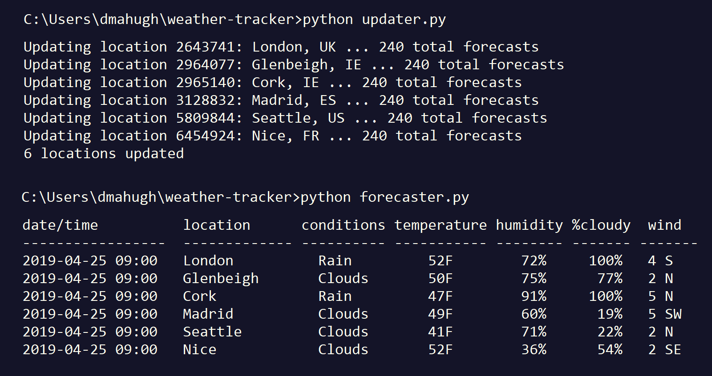

# weather-tracker

This is a simple app I built as a learning exercise, to teach myself the basics of how to work with the [Google Cloud SDK](https://cloud.google.com/sdk/) and the [Cloud SQL](https://cloud.google.com/sql/) managed database service.

The scenario is simple: I'm about to go on vacation and will be visiting a few places around Europe, so I have created a way to check the weather forecast at all of the locations I'll be visiting. Here's a high-level view of how it works:



## source files

```defaults.py``` contains default settings for the database connection and the API key for accessing the [OpenWeatherMap](https://openweathermap.org/) API.

```dbfunctions.py``` contains a few simple helper functions for working with pymysql.

```update.py``` is the code that retrieves forecasts from OpenWeatherMap and saves them into the database.

```forecaster.py``` is code that reads from the database and displays the current forecasts.

## running locally with the Cloud SQL proxy

You'll notice that this simple example appears to be connecting to a local database. (The default host is 127.0.0.1.) This is because I'm using [Cloud SQL Proxy](https://cloud.google.com/sql/docs/mysql/sql-proxy), which communicates with the Cloud SQL database via a secure tunnel connection and exposes that connection to the local code as if the database were running locally.

If you've ever worked with a managed cloud database service that requires you to whitelist a new IP address every time you stop at a coffee shop to do a bit of hacking, you'll appreciate this hassle-free approach. You just set it up once and forget about it. And I found the proxy surprisingly fast &mdash; it _feels_ like a local connection.

You need to remember to start up the proxy before running you do any development and testing. I'm running on Windows, and I created a ```start_proxy.bat``` batch file with this line in it:

```
start cmd.exe /c "cloud_sql_proxy -instances=<database_instance_connection_string>"
```

I can run that command at a command prompt, and it opens a separate command prompt to run the proxy. Due the the ```/c``` switch, that separate window will close if you stop the proxy with Ctrl-C. 

## next steps

To learn about a few _more_ things, here's what I'm planning to do next:

* Containerize the updater and forecaster functionality so that I can deploy them with [Cloud Run](https://cloud.google.com/run/)
* Use [Cloud Scheduler](https://cloud.google.com/scheduler/) to call the updater every 12 hours
* Make the forecaster function serve up a simple web page that shows the current forecasts, with a few niceties such as use of the [OpenWeatherMap weather conditions icons](https://openweathermap.org/weather-conditions).

I'll make those changes and update the repo when I get a chance, but first I need to go on vacation!
