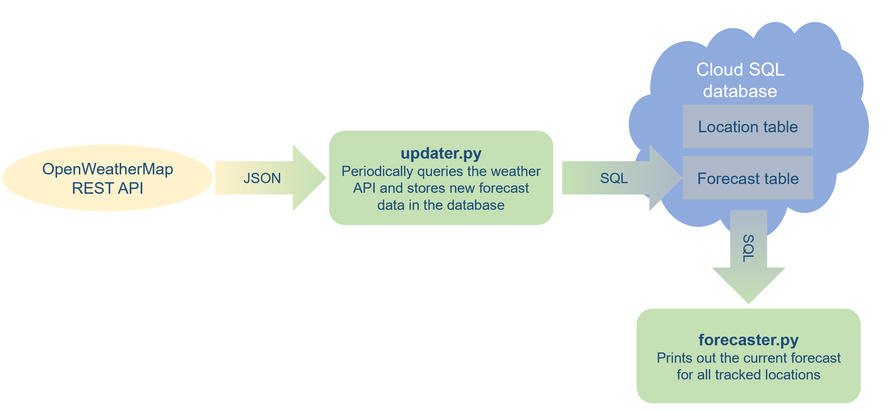

# weather-tracker

This is a simple app I built as a learning exercise, to teach myself the basics of how to work with the [Google Cloud SDK](https://cloud.google.com/sdk/) and the [Cloud SQL](https://cloud.google.com/sql/) managed database service.

I'm about to go on vacation and will be visiting a few places around Europe, so I created a way to check the weather forecast at all of the locations I'll be visiting. It's just implemented as a couple of simple command line scripts so far, but I have plans to take it a little further as covered under Next Steps below. I'm definitely _not_ planning to make it into a full-fledged weather app &mdash; there are lots of those, and my goal here is purely to learn a few things.

Here's a high-level view of how it works:



And here's an example of what it looks like when I run the two programs:


## source files

Brief descriptions of the four Python source code files:

* [```defaults.py```](https://github.com/dmahugh/weather-tracker/blob/master/defaults.py) contains default settings for the database connection and the API key for accessing the [OpenWeatherMap](https://openweathermap.org/) API.
* [```dbfunctions.py```](https://github.com/dmahugh/weather-tracker/blob/master/dbfunctions.py) contains a few simple helper functions for working with pymysql. The ```initialize_database``` function is what I used to create the tables after I had created my database instance in the [Google Cloud Console](https://cloud.google.com/cloud-console/).
* [```update.py```](https://github.com/dmahugh/weather-tracker/blob/master/update.py) is the code that retrieves forecasts from OpenWeatherMap and saves them into the database.
* [```forecaster.py```](https://github.com/dmahugh/weather-tracker/blob/master/forecaster.py) is code that reads from the database and displays the current forecasts.

## running locally with the Cloud SQL proxy

In ```defaults.py``` the default HOST is 127.0.0.1, so it looks like the app is connecting to a local database. That's because I'm using [Cloud SQL Proxy](https://cloud.google.com/sql/docs/mysql/sql-proxy), which communicates with the Cloud SQL database via a secure tunnel connection and exposes that connection to your code as if the database were running locally.

If you've ever worked with a managed cloud database service that requires you to whitelist a new IP address every time you stop at a coffee shop to do a bit of hacking (no comment), you'll appreciate this hassle-free approach. You just set it up once and forget about it. And I found the proxy surprisingly fast &mdash; it _feels_ like a local connection.

You need to remember to start up the proxy before testing your code. I'm running on Windows, so I created a ```start_proxy.bat``` batch file with this line in it:

```
start cmd.exe /c "cloud_sql_proxy -instances=<database_instance_connection_string>"
```

This batch file opens a separate command prompt to run the proxy in, so I'm still free to run Python programs at the command prompt I launched it from. And that separate window closes if you stop the proxy with Ctrl-C, due the the ```/c``` switch on the command line.

## next steps

To learn about a few _more_ things, here's what I'm planning to do next in this simple app:

* Containerize the updater and forecaster functionality so that I can deploy them with [Cloud Run](https://cloud.google.com/run/)
* Use [Cloud Scheduler](https://cloud.google.com/scheduler/) to call the updater every 12 hours
* Make the forecaster function serve up a simple web page that shows the current forecasts, with a few niceties such as use of the [OpenWeatherMap weather conditions icons](https://openweathermap.org/weather-conditions).

One other thing I want to explore is how to best launch the Cloud SQL proxy for windows development. I like the idea of having a pure python solution, such as a function to call on app startup that checks if we're running on my laptop, and if so checks whether the proxy is running. If it's not running, the function could launch it in a separate process and then pause until it's active and available.

I'll start making these changes and update the repo when I get a chance, but first I need to go on vacation! Looks like I need to pack a light jacket.
